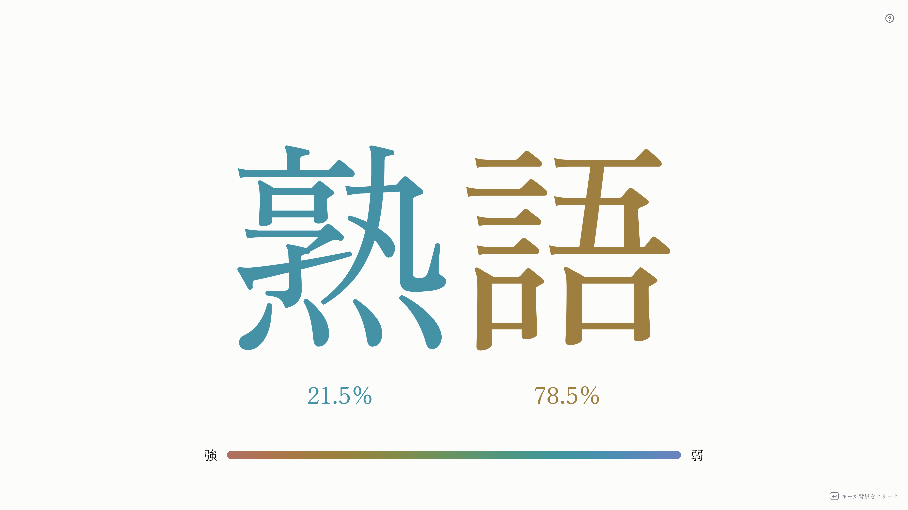

# kanji-semantic-weight



熟語を入力すると、各漢字がその熟語に対してどれくらい意味的に寄与しているかを可視化する Web アプリです。  
Svelte + TypeScript + Vite で実装されています。

## 主な機能

- 漢字のみの熟語入力を受け付ける（2文字以上）
- 各漢字の重みを `0〜100%` で表示
- 重みに応じて色を変えて表示（強 ↔ 弱）
- ダークモード/ライトモードに対応

## セットアップ

```bash
npm install
npm run dev
```

開発サーバー起動後、ブラウザで表示される URL（通常 `http://localhost:5173`）を開いてください。

## 主要ファイル

- `src/App.svelte`: 画面表示と重み計算のメインロジック
- `src/tools/loadWordVec.ts`: 語彙・ベクトルファイルの読み込み
- `src/tools/vectorSimilarity.ts`: 単語間の類似度（内積）計算
- `public/vocab.json`: 語彙データ
- `public/vectors.f32.part0..2`: 分割された埋め込みベクトル

## 注意点

- 入力語や漢字が語彙に存在しない場合はエラー表示になります。
- ベクトルファイルが欠けていると埋め込み読み込みに失敗します。
